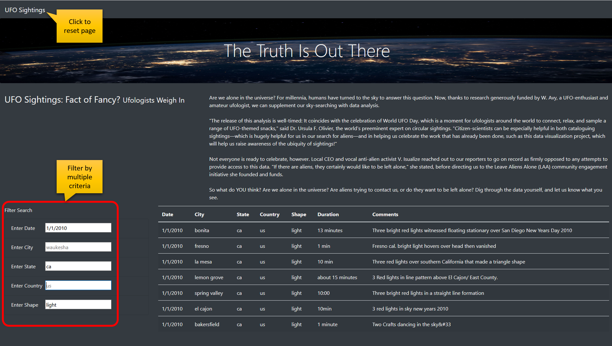

# UFOs
Data Analytics Boot Camp Module 11 - JavaScript project

## Overview of Project

This project is to create a web page which allows the user for view and filter a long list of **UFO sightings**. The user will be able to filter the list by multiple criteria at the same time, such as *date*, *city*, *state*, *country*, and *shape* of UFO.

## Results

User will be able to view a complete list of **UFO Sightings** once at the web page. The list is long, so the user can use the Filter Search form on the left to narrow down result. For example, the user can enter a specific *date*, *city*, *state*, *country*, *shape*, or any combination of the previous list. Every time the filter criteria is entered the data table will be filtered dynamically instantly. 

Please refer to image below for clarification:

 
## Summary

In summary, the dynamic filtering is a great option for the user. One drawback though, the filter fields are case sensitive, which makes it a bit inconvenient for the user.

There are few recommendations I could suggest here:
1. Filter fields should not be case sensitive
2. Use a date picker for the date field. This way the user will always enter the correct date format
3. Have the user select a search-criteria from a pre-populated list of existing values

---

